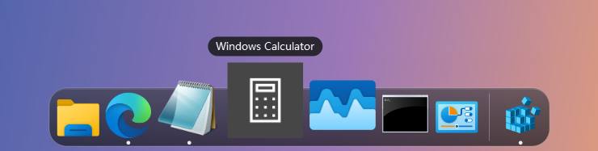
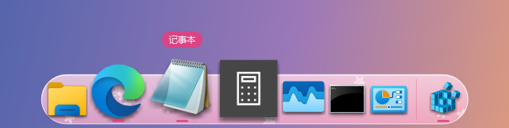
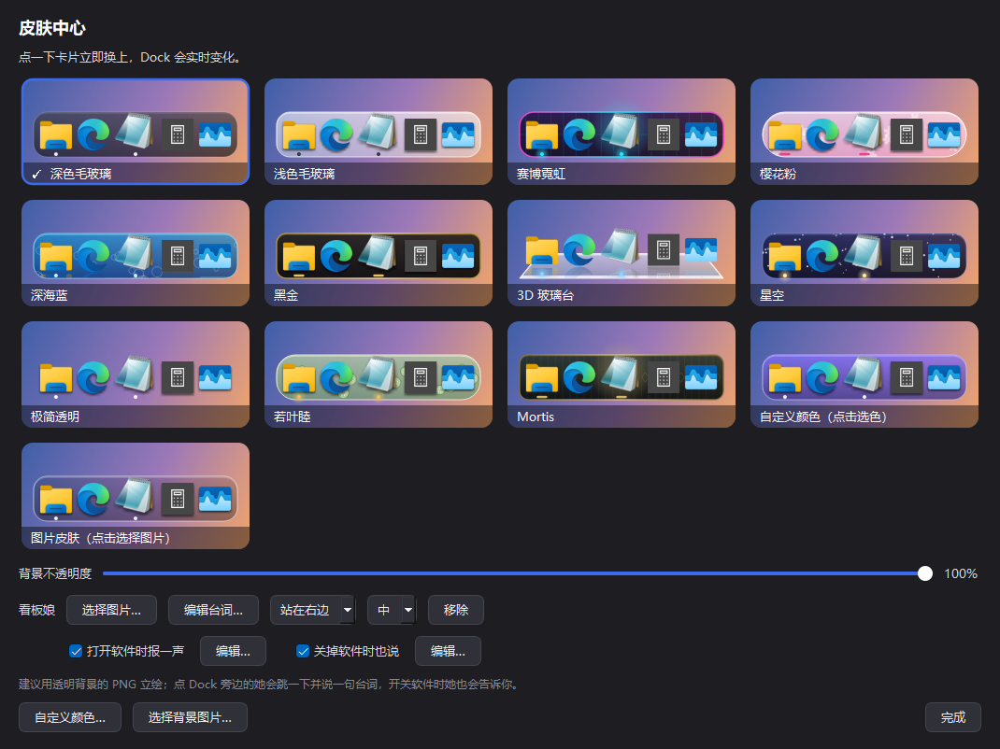

# 楠木 Dock

仿 BitDock / macOS 风格的 Windows 桌面 Dock 栏：鱼眼放大、正在运行的程序、11 款皮肤，还能放一个会说话的看板娘。



## 功能

- **macOS 式放大**：鼠标划过时图标平滑放大，上方显示名称
- **启动 / 切换**：左键启动程序；已经开着就切到它的窗口，再点一次最小化，多窗口轮流切换；中键开新实例
- **正在运行的程序**：有窗口的程序下面显示小圆点，没固定的显示在分隔线右边，右键可以「固定到 Dock」
- **拖拽管理**：把程序、快捷方式、文件夹、网址拖到 Dock 上添加；按住图标左右拖排序，拖出 Dock 上方松开移除
- **隐藏任务栏 / 桌面图标**：可选隐藏 Windows 任务栏和桌面图标，退出 Dock 时一定会恢复
- **全局快捷键**：`Ctrl+Alt+H` 显示/隐藏 Dock，`Ctrl+Alt+D` 显示/隐藏桌面图标，还可以给任务栏设一个；全部在「快捷键设置」里自由修改
- **皮肤中心**：11 款内置皮肤，支持自定义主色、自定义背景图片、背景不透明度
- **看板娘**：自带一个原创 Q 版小人，也可以换成任意透明背景的 PNG。点她会跳一下说句话，开关软件时会告诉你「打开了 Steam。」「Steam……关掉了。」，台词都能自己改
- **省资源**：空闲时 CPU 约 0.3%，内存约 80 MB；全屏玩游戏、看视频时自动隐藏
- 自动隐藏、开机自启、托盘图标、图标大小和放大倍数可调

## 皮肤

| 赛博霓虹 | 樱花粉 |
|---|---|
|  |  |
| **3D 玻璃台** | **若叶睦** |
|  |  |



## 看板娘

皮肤中心里点「内置小人」就能用上，点「选择图片…」可以换成你自己的图。


## 下载使用

### 方式一：直接下载 exe（推荐）

1. 到 [Releases](../../releases) 下载最新的 `NanmuDock-vX.X.X-win64.zip`
2. 解压到任意文件夹，双击 `NanmuDock.exe`
3. 右键 Dock 打开设置和皮肤中心

> 第一次运行时 Windows 可能弹出「Windows 已保护你的电脑」，这是因为 exe 没有花钱买数字签名。点「更多信息 → 仍要运行」即可。个别杀毒软件可能误报 PyInstaller 打包的程序，介意的话可以用方式二从源码运行。

### 方式二：从源码运行

需要 Windows 10/11 和 Python 3.10 以上。

```bash
pip install -r requirements.txt
pythonw nanmu_dock.pyw
```

也可以直接双击 `nanmu_dock.pyw` 或 `启动Dock.bat`。

### 自己打包 exe

```bash
pip install -r requirements.txt pyinstaller
python build.py
```

打包结果在 `release/` 文件夹。

## 常见问题

**隐藏 Dock 之后怎么找回来？**
按 `Ctrl+Alt+H`；或者再双击一次 `NanmuDock.exe`（或 `nanmu_dock.pyw`），不会开出第二个；也可以单击右下角托盘里的 Dock 图标。

**任务栏 / 桌面图标没了怎么办？**
正常退出 Dock 会自动恢复。如果 Dock 是被任务管理器强制结束的，双击 `恢复任务栏和桌面图标.bat` 即可。

**配置存在哪？**
程序所在文件夹的 `dock_config.json`，图片皮肤和看板娘的图片会复制到 `skins/` 文件夹。整个文件夹可以随意挪动。

**开机自启？**
右键 Dock →「设置」→「开机自启」。

## 关于角色皮肤和看板娘

- 「若叶睦」「Mortis」皮肤和内置的 Q 版小人都是粉丝向的原创作品：皮肤只用了配色和简单的装饰图形，小人是用代码从零画的（见 `assets/draw_mascot.py`），**不包含任何官方素材**。角色版权归 BanG Dream! 项目（Bushiroad）所有。
- 换成自己的看板娘时，请使用你有权使用的图片。

## 许可证

[MIT](LICENSE)
